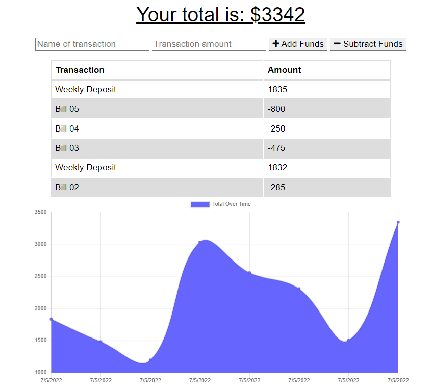

Vik's Budget Tracker

## Description

Keeping track of personal finances is important - it is extra important for a person who travels often. Their need to track withdrawals and deposits while on the go is essential, hence the reason for the creation of this full-stack web application.

The app runs entirely in the browser, can be accessed from anywhere, and was created utilizing JavaScript, Node.js, Express.js, and MongoDB. It includes the following features:

- The user is able to use the site with or without an internet connection
- Once the user enters an expense or deposit, they will receive a notification that they have done so
- If the user is offline, once their internet connection is reestablished, then the transactions added while they were offline are added to their history and their totals are updated

Here is a screenshot example of the app in use:



The deployed site can be found at https://vik-budget-tracker.herokuapp.com.


## Installation

To install this application, first clone the repo to your local machine. Then, you will need to install the node dependencies/modules which can be done by running the ```npm install``` command in your terminal/bash shell. 

## Usage

Once the dependencies are installed, to use the application, initialize the server with the following command, ```npm run start```, and it can then be opened locally (or accessed any time via the above deployed site url).

## Credits

Collaborators include the instructor, TAs, and fellow classmates of the UCF Coding Bootcamp (Spring 2022).


## License

Copyright (c) 2022 Vik Maharaj

Permission is hereby granted, free of charge, to any person obtaining a copy of this software and associated documentation files (the "Software"), to deal
in the Software without restriction, including without limitation the rights to use, copy, modify, merge, publish, distribute, sublicense, and/or sell copies of the Software, and to permit persons to whom the Software is furnished to do so, subject to the following conditions:

The above copyright notice and this permission notice shall be included in all copies or substantial portions of the Software.

THE SOFTWARE IS PROVIDED "AS IS", WITHOUT WARRANTY OF ANY KIND, EXPRESS OR IMPLIED, INCLUDING BUT NOT LIMITED TO THE WARRANTIES OF MERCHANTABILITY,
FITNESS FOR A PARTICULAR PURPOSE AND NONINFRINGEMENT. IN NO EVENT SHALL THE AUTHORS OR COPYRIGHT HOLDERS BE LIABLE FOR ANY CLAIM, DAMAGES OR OTHER LIABILITY, WHETHER IN AN ACTION OF CONTRACT, TORT OR OTHERWISE, ARISING FROM, OUT OF OR IN CONNECTION WITH THE SOFTWARE OR THE USE OR OTHER DEALINGS IN THE SOFTWARE.


## Badges


[](https://opensource.org/licenses/MIT)